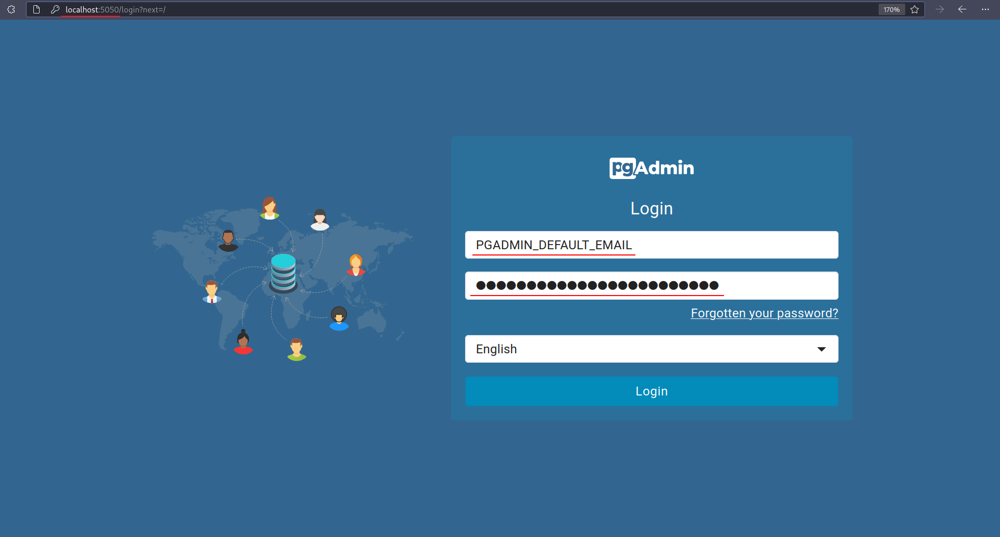
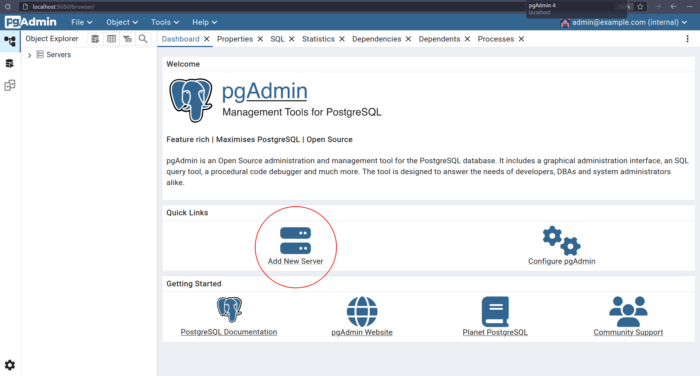
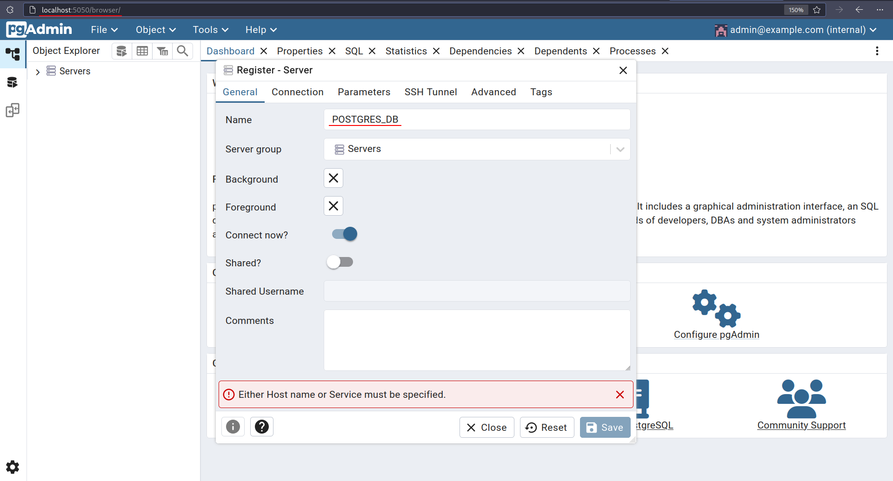
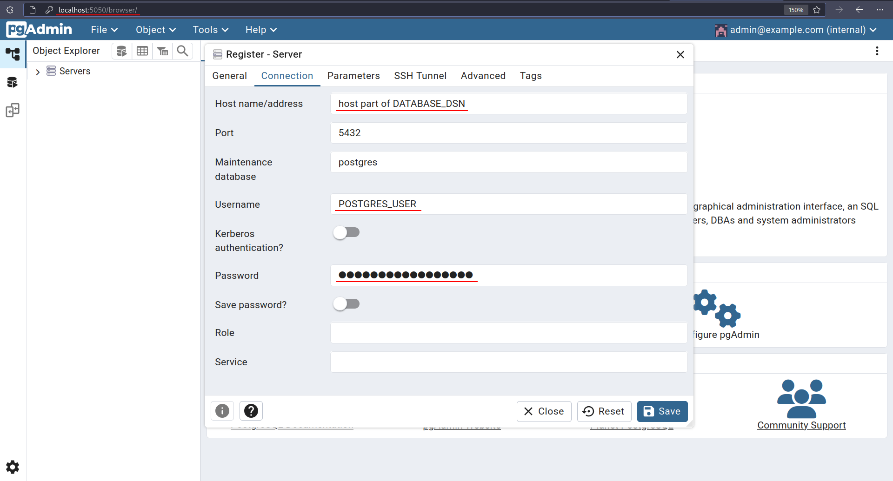
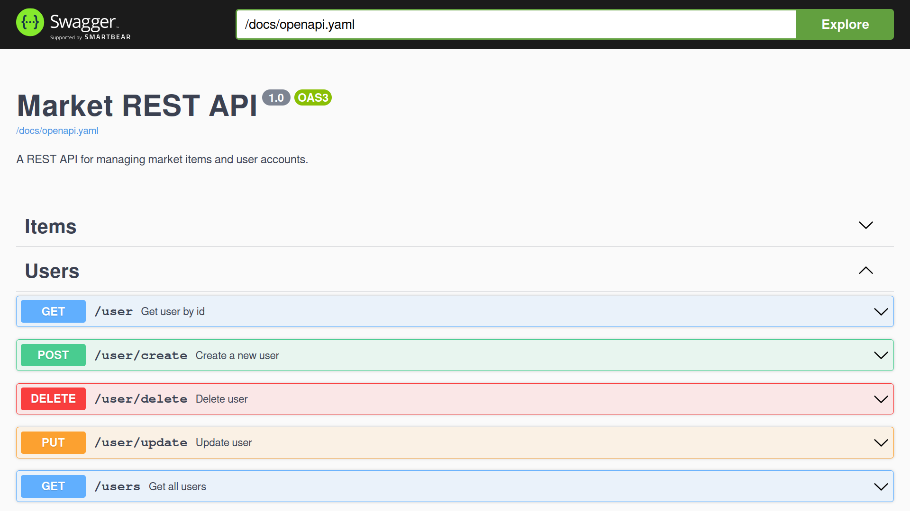
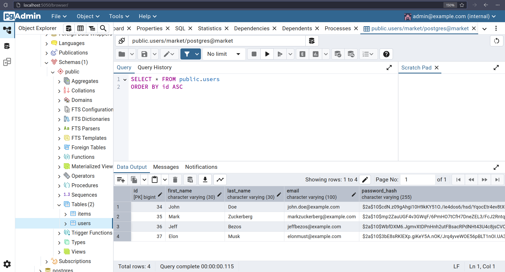

## A market REST API for entering NIC at IITU.

A simple, minimalistic REST API built in **Go** for managing market data. <br />
The project includes an integrated **Swagger UI** for interactive API documentation. <br />
Additionally, the project can be run either using **Docker** or directly on your local machine.

### 🛠 Tech Stack
- **Backend:** Go
- **Database:** Postgres (pgAdmin), Redis
- **Containerization:** Docker
- **Web Server & Reverse Proxy:** Nginx
- **CI/CD:** GitHub Actions

### 📂 Project Structure:

```bash
market-rest-api
├── cmd/market-rest-api    # Entry point for the application
│   └── main.go
├── docker-compose.yaml    # Docker Compose setup
├── Dockerfile             # Docker image build instructions
├── docs/openapi.yaml      # API documentation (OpenAPI/Swagger)
├── internal/              # Application business logic
│   ├── app/               # Bootstrap (server setup, migrations, etc.)
│   ├── config/            # Configuration loading and validation
│   ├── handlers/          # HTTP handlers (controllers)
│   ├── logger/            # Application‑level logging setup
│   ├── models/            # Domain/data models
│   ├── repositories/      # Database interaction layer
│   └── services/          # Core business logic
├── pkg/                   # Reusable packages
│   ├── ginhelpers/        # Gin context helpers
│   ├── jwt/               # JWT generation, cookies, password hashing
│   ├── logger/            # Logger interface & wrappers
│   └── redis/             # Redis connection & token store
├── nginx/                 # Nginx reverse‑proxy config
│   └── conf.d/default.conf
├── Makefile               # Build/test/lint/deploy commands
└── README.md              # This file
```

### Installation & Running with Docker

1. Clone the repository

```bash
git clone https://github.com/DaniilKalts/market-rest-api.git
cd market-rest-api
```

2. Create .env (environment variables) file and fill it with your values

```bash
# HTTP PORT
PORT=8080

# BASE URL
BASE_URL=http://localhost:8080/

# DOMAIN
DOMAIN=localhost

# REDIS
# SET @localhost if you wanna run the project locally
# SET @redis if you wanna run the project via Docker
REDIS_DSN="redis://:yourpassword@redis:6379/0"
REDIS_PASSWORD=yourpassword

# DATABASE DSN
# SET host=localhost if you wanna run the project locally
# SET host=postgres if you wanna run the project via Docker
POSTGRES_DSN=host=postgres user=postgres password=yourpassword dbname=market port=5432 sslmode=disable TimeZone=UTC

# POSTGRES
POSTGRES_USER=postgres
POSTGRES_PASSWORD=yourpassword
POSTGRES_DB=market

# PGADMIN
PGADMIN_DEFAULT_EMAIL=admin@example.com
PGADMIN_DEFAULT_PASSWORD=yourpassword

# SECRET
SECRET=f0a63a95bc42f43c4e21bae68005c09e52414758065e5ab6a1799a269b04a6c773eb80b4c0d6d408f2209a321cfe448ce737f51fe3afd0d13e70b110fff1fcd1a5c3a062154a20d2bb94d309f315b85420ff09f100ca511d391723aab332e5bb71392aacc2e942eba4345f1e8eecdc2b557ea684bff7575f473f410108e8537605736993124d8d5668a32f4e0268886bf49c9fd99c78d68163cc010398ca0d17a86bd1b23a4c3fc0201ebaa81afb8ef7d0f4c5702ebe1ecaba72dc11c044dfaecb1ffdba9db6bdb9f0eaf60a87247305158faecaba7ba46ecdaa56181d645050836aa1a38629ea88623d111aa639f4b7da1718de24fe34f8ccc6e7020e91659d

# ADMIN
ADMIN_FIRST_NAME=John
ADMIN_LAST_NAME=Doe
ADMIN_EMAIL=admin@example.com
ADMIN_PASSWORD=admin1234
ADMIN_PHONE_NUMBER=+70000000000
```

3. Run docker-compose up to create and start containers

```bash
docker-compose up
```

4. Open `localhost:5050` and log in to pgAdmin using credentials from the `.env` file:

- **Email:** `PGADMIN_DEFAULT_EMAIL`
- **Password:** `PGADMIN_DEFAULT_PASSWORD`



5. Create a new server in pgAdmin



6. Set the server name using the value of `POSTGRES_DB` from the `.env` file.



7. Configure the connection settings:

- **Host:** Use the host value from `DATABASE_DSN`.
- **Username:** `POSTGRES_USER`
- **Password:** `POSTGRES_PASSWORD`



### Installation & Running Locally (Without Docker)

1. Clone the repository

```bash
git clone https://github.com/DaniilKalts/market-rest-api.git
cd market-rest-api
```

2. Create .env (environment variables) file and fill it with your values

```bash
# HTTP PORT
PORT=8080

# DATABASE DSN
# SET host=localhost if you wanna run the project locally
DATABASE_DSN=host=localhost user=postgres password=yourpassword dbname=market port=5432 sslmode=disable TimeZone=UTC
```

3. Install dependencies

```bash
go mod tidy
```

4. Run the project

```bash
make run
```

### API Documentation - Swagger UI

Access the interactive API documentation at:

```bash
http://localhost:8080/swagger/index.html
```



### Database Management - pgAdmin

Manage the PostgreSQL database using pgAdmin at:

```bash
http://localhost:5050
```

