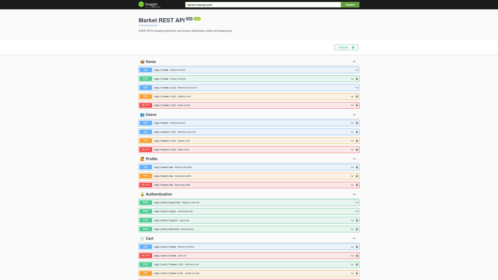

## A market REST API for entering NIC at IITU.

A simple, minimalistic REST API built in **Go** for managing market data. <br />
The project includes an integrated **Swagger UI** for interactive API documentation. <br />
Additionally, the project can be run either using **Docker** or directly on your local machine.

### 1. Installation & Running with Docker

1. Clone the repository

```bash
git clone https://github.com/DaniilKalts/market-rest-api.git
cd market-rest-api
```

2. Create .env (environment variables) file and fill it with your values

```bash
# HTTP PORT
PORT=8080

# DATABASE DSN
# SET host=localhost if you wanna run the project locally
DATABASE_DSN=host=postgres user=postgres password=yourpassword dbname=market port=5432 sslmode=disable TimeZone=UTC

# POSTGRES
POSTGRES_USER=postgres
POSTGRES_PASSWORD=yourpassword
POSTGRES_DB=market

# PGADMIN
PGADMIN_DEFAULT_EMAIL=admin@example.com
PGADMIN_DEFAULT_PASSWORD=yourpassword
```

3. Run docker-compose up to create and start containers

```bash
docker-compose up
```

4. Open `localhost:5050` and log in to pgAdmin using credentials from the `.env` file:

- **Email:** `PGADMIN_DEFAULT_EMAIL`
- **Password:** `PGADMIN_DEFAULT_PASSWORD`


5. Create a new server in pgAdmin


6. Set the server name using the value of `POSTGRES_DB` from the `.env` file.


7. Configure the connection settings:

- **Host:** Use the host value from `DATABASE_DSN`.
- **Username:** `POSTGRES_USER`
- **Password:** `POSTGRES_PASSWORD`


### 2. Installation & Running Locally (Without Docker)

1. Clone the repository

```bash
git clone https://github.com/DaniilKalts/market-rest-api.git
cd market-rest-api
```

2. Create .env (environment variables) file and fill it with your values

```bash
# HTTP PORT
PORT=8080

# DATABASE DSN
# SET host=localhost if you wanna run the project locally
DATABASE_DSN=host=localhost user=postgres password=yourpassword dbname=market port=5432 sslmode=disable TimeZone=UTC
```

3. Install dependencies

```bash
go mod tidy
```

4. Run the project

```bash
make run
```

### API Documentation - Swagger UI

Access the interactive API documentation at:

```bash
http://localhost:8080/swagger/index.html
```



### Database Management - pgAdmin

Manage the PostgreSQL database using pgAdmin at:

```bash
http://localhost:5050
```


### Project Structure

```bash
market-rest-api
market-rest-api
├── cmd/market-rest-api    # Entry point for the application
│   └── main.go
├── docker-compose.yaml    # Docker configuration
├── Dockerfile             # Docker image setup
├── docs/openapi.yaml      # API documentation (OpenAPI/Swagger)
├── internal/              # Application business logic
│   ├── app/               # Application bootstrap
│   ├── config/            # Configuration handling
│   ├── handlers/          # API handlers (Controllers)
│   ├── logger/            # Logging setup
│   ├── models/            # Database models
│   ├── repositories/      # Database interaction
│   └── services/          # Business logic layer
├── Makefile               # Automation commands
└── README.md              # Project documentation
```
